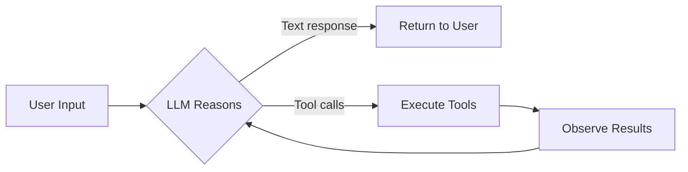
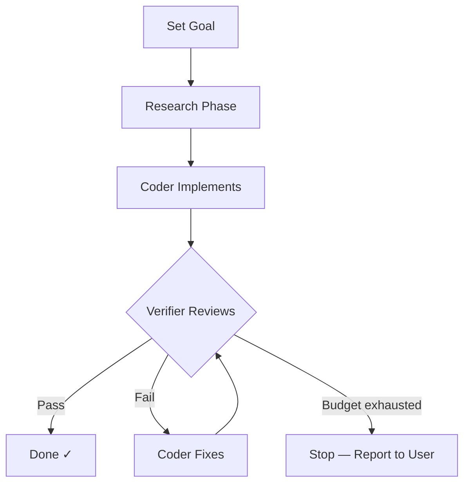
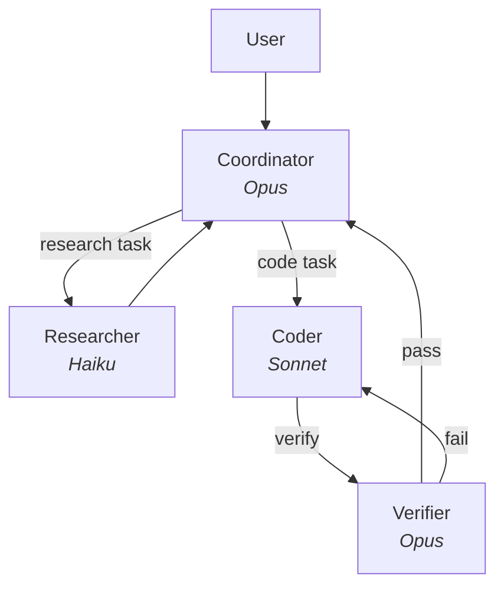
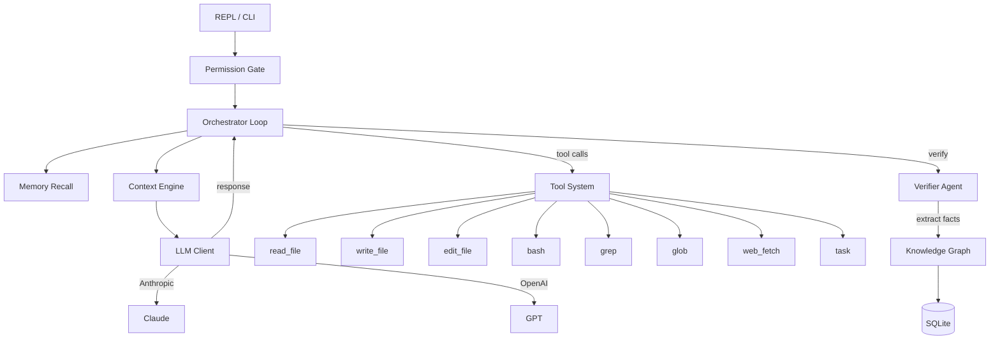

<div align="center">

# ⚔️ rapier-ai

**A loop-engineered coding agent — set a goal, watch it iterate.**

[](https://www.python.org/downloads/)
[](LICENSE)

---

Like the weaving rapier — a thin, precise shuttle that carries thread back and forth across a loom — **rapier-ai** carries your intent through iterative loops of **code → verify → refine** until the goal is met.

</div>

---

## Why rapier-ai?

Existing coding agents operate in one-shot mode: you prompt, they respond, done. rapier-ai operates in **goal loops** — you set an objective, and the agent iterates through planning, coding, verification, and refinement until the goal is provably complete.

| Feature | Claude Code | Aider | Cursor | **rapier-ai** |
|---|:---:|:---:|:---:|:---:|
| Loop engineering core | ✗ | ✗ | ✗ | **✓** |
| Maker/Checker split | subagent | ✗ | ✗ | **different model** |
| Token-efficient context | ✗ | ✗ | partial | **✓ + knowledge graph** |
| Persistent memory | CLAUDE.md | ✗ | ✗ | **knowledge graph** |
| Provider lock-in | Anthropic | any | OpenAI | **any OpenAI-compatible** |
| Language | TypeScript | Python | TypeScript | **Python** |

---

## How It Works

### The ReACT Loop

Every interaction follows the **Reason → Act → Observe** cycle:



### Goal-Based Iteration

Set a goal, and rapier-ai iterates until verified complete:



### Multi-Agent Architecture

Hub-and-spoke model — coordinator holds full context, workers get minimal:



---

## Quick Start

```bash
# Install
pip install rapier-ai

# Set your API key
export ANTHROPIC_API_KEY=sk-ant-...

# Start the REPL
rapier

# Or set a goal and watch it iterate
rapier --goal "add error handling to the API routes"

# Use OpenAI instead
rapier --provider openai --model gpt-4o
```

---

## Architecture



---

## Development

```bash
# Clone
git clone https://github.com/souravkumardubey/rapier-ai.git
cd rapier-ai

# Create venv and install
uv venv --python 3.14
source .venv/bin/activate
uv pip install -e ".[dev]"

# Run tests
pytest tests/

# Lint + format
ruff check .
ruff format .

# Type check
mypy rapier/
```

---

## Built With

- [Anthropic SDK](https://github.com/anthropics/anthropic-sdk-python) — Claude API
- [OpenAI SDK](https://github.com/openai/openai-python) — GPT API
- [Rich](https://github.com/Textualize/rich) — Terminal formatting
- [Click](https://github.com/pallets/click) — CLI framework
- [tiktoken](https://github.com/openai/tiktoken) — Token counting
- [sentence-transformers](https://github.com/UKPLab/sentence-transformers) — Local embeddings

---

## License

[MIT](LICENSE) — do whatever you want.

---

<div align="center">

**Built with precision. Iterated with purpose.**

</div>
